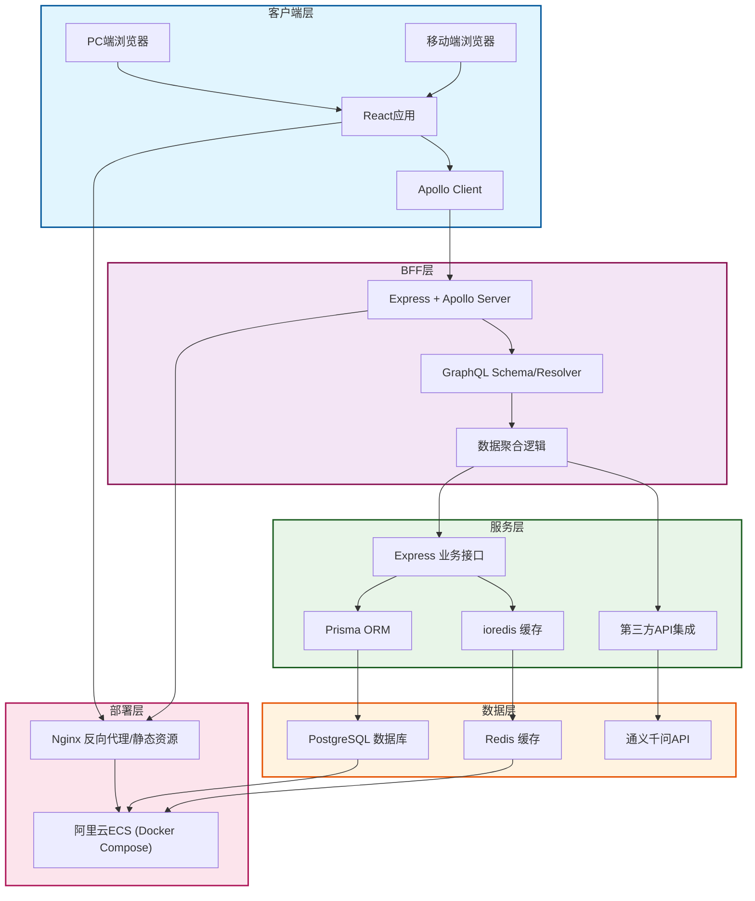

# 全栈博客系统（前端转全栈练手项目）
[](https://opensource.org/licenses/MIT)

## 1. 项目介绍
### 1.1 核心目标
- 前端开发者转全栈的练手项目，串联「React + Node.js + GraphQL + PostgreSQL」全栈技术栈
- 实现博客核心功能，同时作为面试开源项目展示全栈设计能力和工程化思维
- 探索BFF层（Backend For Frontend）+ GraphQL的前端驱动架构模式

### 1.2 核心功能
| 功能模块       | 具体能力                                                                 |
|----------------|--------------------------------------------------------------------------|
| 用户认证       | 注册/登录（JWT）、Token校验、权限控制                                   |
| 文章管理       | 发布/编辑/删除文章、分页查询、全文检索                                   |
| 广场浏览       | 文章列表展示、作者信息关联、阅读量统计                                   |
| AI助手         | 调用通义千问API实现文章总结、标题建议（BFF层聚合第三方API）               |
| 移动端适配     | 基于Antd Mobile实现响应式布局，适配PC/移动端                             |

## 2. 技术架构
### 2.1 整体架构图


### 2.2 技术栈明细
| 分层         | 核心技术                                                                 | 选型理由                                                                 |
|--------------|--------------------------------------------------------------------------|--------------------------------------------------------------------------|
| 前端         | React 18 + Apollo Client + Antd Mobile + Vite 5                          | 主流前端框架，Apollo Client适配GraphQL，Antd Mobile专注移动端适配         |
| BFF层        | Node.js + Express + Apollo Server + GraphQL                              | Express学习成本低，Apollo Server原生支持GraphQL，BFF层聚合多数据源        |
| 数据层       | Express + Prisma + PostgreSQL + ioredis                                  | Prisma零SQL基础上手，TypeScript类型安全，PostgreSQL适配全文检索场景      |
| 部署         | Docker Compose + Nginx + 阿里云ECS + SSL证书                             | Docker一键部署，Nginx实现反向代理和HTTPS，适配99元ECS轻量部署            |

### 2.3 核心设计亮点
#### （1）BFF层+GraphQL架构
- 解决REST API「过度请求/请求不足」问题：前端按需获取字段，一次请求聚合文章+作者+AI总结数据
- 多端适配：PC/移动端通过GraphQL Fragment获取不同字段，后端无需适配多套接口
- 类型安全：GraphQL Schema自动生成前端TS类型，前后端类型统一

#### （2）工程化规范
- 全栈TypeScript：统一前后端类型，编译期发现类型错误
- Prisma数据迁移：自动化管理数据库表结构，避免手动改表
- Docker Compose部署：一键启动所有服务，环境一致性保障

#### （3）性能优化
- Redis缓存：缓存热门文章、用户Token、阅读量，降低数据库压力
- GraphQL缓存：Apollo Client智能缓存，减少重复请求
- Nginx静态资源缓存：Gzip压缩、静态资源CDN加速

## 3. 本地运行指南
### 3.1 环境准备
- Node.js 18+（LTS版本）
- PostgreSQL 16+
- Redis 7+（可选）
- Docker + Docker Compose（可选，一键部署依赖）

### 3.2 后端运行（BFF+数据层）
```bash
# 1. 克隆代码
git clone https://github.com/你的用户名/blog-fullstack.git
cd blog-fullstack/server

# 2. 安装依赖
npm install

# 3. 配置环境变量
cp .env.example .env
# 编辑.env文件，填写PostgreSQL/Redis/AI API配置

# 4. Prisma初始化（创建数据库表）
npx prisma migrate dev --name init

# 5. 启动服务（默认端口4000）
npm run dev
# GraphQL调试地址：http://localhost:4000/graphql
```

### 3.3 前端运行
```bash
# 1. 进入前端目录
cd blog-fullstack/client

# 2. 安装依赖
npm install

# 3. 启动开发服务（默认端口5173）
npm run dev
# 访问地址：http://localhost:5173
```

### 3.4 Docker一键部署
```bash
# 1. 根目录执行
docker-compose up -d

# 2. 访问地址
# 前端：http://localhost
# GraphQL调试：http://localhost:4000/graphql
```

## 4. 核心功能实现
### 4.1 用户认证（JWT + GraphQL）
```graphql
# GraphQL Mutation
mutation Login($username: String!, $password: String!) {
  login(username: $username, password: $password) {
    token
    user {
      id
      username
    }
  }
}
```
- 密码通过BCrypt加密存储，JWT Token包含用户ID和过期时间
- Apollo Client请求头自动携带Token，Express中间件校验Token有效性

### 4.2 文章发布（GraphQL + Prisma）
```graphql
# GraphQL Mutation
mutation PublishArticle($title: String!, $content: String!) {
  publishArticle(title: $title, content: $content) {
    id
    title
    createTime
    user {
      username
    }
  }
}
```
- Prisma自动生成参数化SQL，防SQL注入
- 发布成功后Apollo Client自动刷新文章列表缓存

### 4.3 AI文章总结（BFF层聚合第三方API）
```graphql
# GraphQL Query
query ArticleSummary($articleId: ID!) {
  articleSummary(articleId: $articleId) {
    id
    title
    summary
  }
}
```
- BFF层先从数据库获取文章内容，再调用通义千问API生成总结
- 结果缓存到Redis，避免重复调用第三方API

## 5. 项目结构
```
blog-fullstack/
├── client/          # 前端React项目
├── server/          # 后端BFF+数据层
│   ├── prisma/      # Prisma配置和模型
│   ├── src/
│   │   ├── graphql/ # GraphQL Schema和Resolver
│   │   ├── api/     # 业务接口
│   │   ├── cache/   # Redis缓存逻辑
│   │   ├── utils/   # 工具函数
│   │   └── app.js   # Express入口
│   ├── .env.example # 环境变量示例
│   └── package.json
├── docker-compose.yml # Docker部署配置
├── nginx/           # Nginx配置
└── README.md        # 项目文档
```

## 6. 待优化方向
- 接口限流：添加Rate Limiter防止恶意请求
- SSR优化：接入Next.js提升首屏加载速度
- 多端适配：补充小程序端适配
- 监控告警：添加接口日志和错误监控

## 7. 面试适配说明
### 7.1 核心技术亮点讲解
- BFF层设计：前端驱动的服务端架构，解决多数据源聚合和多端适配问题
- GraphQL实践：对比REST API的优劣，按需获取数据的实现思路
- 全栈TypeScript：类型安全的工程化实践，前后端类型统一

### 7.2 问题解决案例
- 部署问题：ECS端口未开放导致接口访问失败，通过安全组配置解决
- 性能问题：文章列表查询慢，通过PostgreSQL索引+Redis缓存优化
- 类型问题：GraphQL Schema与前端类型不匹配，通过代码生成工具解决

## 8. 许可证
本项目基于MIT许可证开源，仅供学习和面试展示使用。
