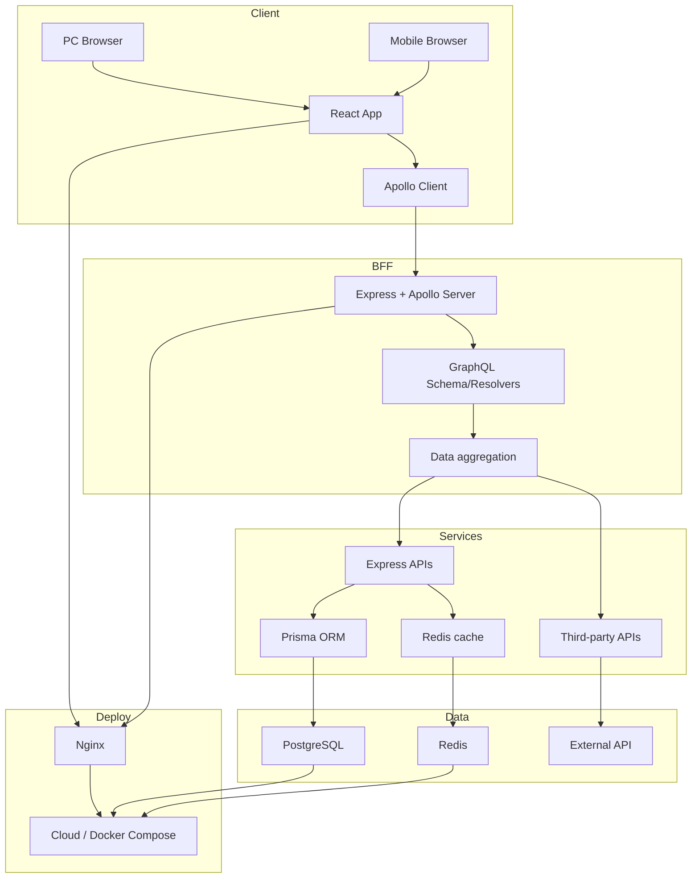

# Full-Stack Blog

[](https://opensource.org/licenses/MIT)

**English** | [简体中文](./README.zh-CN.md)

A full-stack blog system for front-end developers learning the full stack: React, Node.js, GraphQL, and PostgreSQL. It demonstrates BFF (Backend For Frontend) + GraphQL and serves as a portfolio / interview project.

## 1. Overview

### 1.1 Goals

- Practice full-stack development with **React + Node.js + GraphQL + PostgreSQL**
- Implement core blog features and showcase architecture and tooling
- Explore a **BFF + GraphQL** front-end–driven architecture

### 1.2 Features

| Module        | Capabilities                                                                 |
|---------------|-------------------------------------------------------------------------------|
| Auth          | Register / Login (JWT), token validation, role-based access                    |
| Posts         | Create / edit / delete posts, pagination, full-text search                   |
| Feed          | Post list with author info and view counts                                   |
| AI            | Article summarization and title suggestions via external API (e.g. DashScope)|
| Responsive    | PC and mobile layout (e.g. Ant Design Mobile)                               |

## 2. Architecture

### 2.1 High-Level Diagram



### 2.2 Tech Stack

| Layer   | Technologies                                                                 | Rationale                                                                 |
|---------|-------------------------------------------------------------------------------|----------------------------------------------------------------------------|
| Frontend| React 18, Apollo Client, Vite 5                                              | GraphQL client, fast dev server                                           |
| BFF     | Node.js, Express, Apollo Server, GraphQL                                     | Single BFF for multiple data sources                                     |
| Data    | Prisma, PostgreSQL, (optional) Redis                                        | Type-safe ORM, migrations, optional caching                              |
| Deploy  | Docker Compose, Nginx, (e.g. Aliyun ECS)                                     | Reproducible env, reverse proxy, HTTPS                                    |

### 2.3 Design Highlights

- **BFF + GraphQL**: One request for exactly the fields needed; aggregate posts, authors, and AI data in the BFF.
- **Full-stack TypeScript**: Shared types and compile-time checks.
- **Structured logging**: Pino with redaction and request-scoped IDs.

## 3. Getting Started

### 3.1 Prerequisites

- Node.js 18+ (LTS)
- PostgreSQL 16+
- (Optional) Redis 7+, Docker & Docker Compose

### 3.2 Backend (BFF + data)

```bash
# 1. Clone and install
git clone https://github.com/your-username/blog-fullstack.git
cd blog-fullstack
pnpm install

# 2. Environment
cp apps/server/.env.example apps/server/.env
# Edit apps/server/.env (DATABASE_URL, JWT_SECRET, etc.)

# 3. Database
cd apps/server && pnpm exec prisma migrate dev --name init

# 4. Start server (default port 4000)
pnpm dev:server
# GraphQL: http://localhost:4000/graphql
```

### 3.3 Frontend

```bash
# From repo root (after pnpm install)
pnpm dev:client
# App: http://localhost:5173
```

### 3.4 Docker

```bash
docker-compose up -d
# Frontend: http://localhost
# GraphQL: http://localhost:4000/graphql
```

## 4. Core Usage

### 4.1 Auth (JWT + GraphQL)

```graphql
mutation Login($email: String!, $password: String!) {
  login(email: $email, password: $password) {
    token
    user {
      id
      email
      roles { name }
    }
  }
}
```

- Passwords hashed with bcrypt; JWT holds user id and expiry.
- Client sends `Authorization: Bearer <token>`; server validates in GraphQL context and attaches user to `context`.

### 4.2 Posts (GraphQL + Prisma)

```graphql
mutation PublishArticle($title: String!, $content: String!) {
  publishArticle(title: $title, content: $content) {
    id
    title
    createdAt
    user { email }
  }
}
```

- Prisma generates parameterized SQL.
- Use Apollo Client cache policies to refetch lists after mutations.

### 4.3 AI summary (BFF aggregation)

- BFF loads post from DB, calls external API for summary, optionally caches in Redis.

## 5. Project Layout

```
blog-fullstack/
├── apps/
│   ├── client/           # React (Vite) frontend
│   └── server/           # Express + Apollo + Prisma
│       ├── prisma/
│       ├── src/
│       │   ├── graphql/   # Schema & resolvers
│       │   ├── middleware/
│       │   ├── service/
│       │   ├── utils/     # JWT, crypto, logger
│       │   └── app.ts
│       └── .env.example
├── docker-compose.yml
├── nginx/
├── README.md
└── README.zh-CN.md
```

## 6. Possible Improvements

- Rate limiting
- SSR (e.g. Next.js) for faster first paint
- More clients (e.g. mini-program)
- Metrics and alerting

## 7. License

MIT. For learning and portfolio use.
