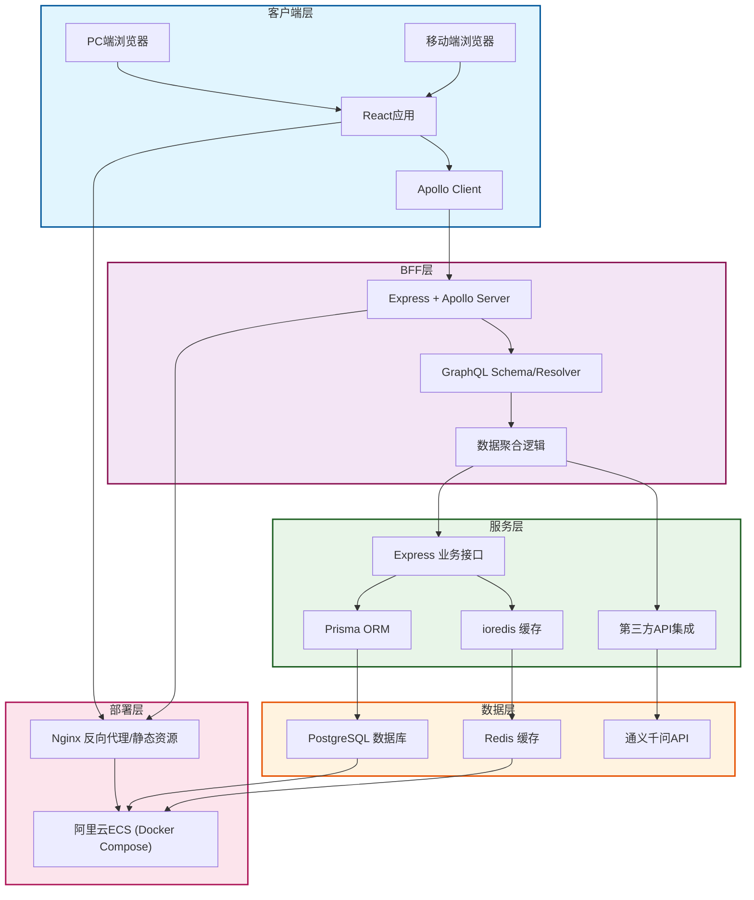

# 全栈博客系统
[](https://opensource.org/licenses/MIT)

**简体中文** | [English](./README.md)

## 1. 项目介绍
### 1.1 核心目标
- 前端开发者转全栈的练手项目，串联「React + Node.js + GraphQL + PostgreSQL」全栈技术栈
- 实现博客核心功能，同时作为面试开源项目展示全栈设计能力和工程化思维
- 探索BFF层（Backend For Frontend）+ GraphQL的前端驱动架构模式

### 1.2 核心功能
| 功能模块       | 具体能力                                                                 |
|----------------|--------------------------------------------------------------------------|
| 用户认证       | 注册/登录（JWT）、Token校验、权限控制                                   |
| 文章管理       | 发布/编辑/删除文章、分页查询、全文检索                                   |
| 广场浏览       | 文章列表展示、作者信息关联、阅读量统计                                   |
| AI助手         | 调用通义千问API实现文章总结、标题建议（BFF层聚合第三方API）               |
| 移动端适配     | 基于Antd Mobile实现响应式布局，适配PC/移动端                             |

## 2. 技术架构
### 2.1 整体架构图


### 2.2 技术栈明细
| 分层         | 核心技术                                                                 | 选型理由                                                                 |
|--------------|--------------------------------------------------------------------------|--------------------------------------------------------------------------|
| 前端         | React 18 + Apollo Client + Antd Mobile + Vite 5                          | 主流前端框架，Apollo Client适配GraphQL，Antd Mobile专注移动端适配         |
| BFF层        | Node.js + Express + Apollo Server + GraphQL                              | Express学习成本低，Apollo Server原生支持GraphQL，BFF层聚合多数据源        |
| 数据层       | Express + Prisma + PostgreSQL + ioredis                                  | Prisma零SQL基础上手，TypeScript类型安全，PostgreSQL适配全文检索场景      |
| 部署         | Docker Compose + Nginx + 阿里云ECS + SSL证书                             | Docker一键部署，Nginx实现反向代理和HTTPS，适配99元ECS轻量部署            |

### 2.3 核心设计亮点
#### （1）BFF层+GraphQL架构
- 解决REST API「过度请求/请求不足」问题：前端按需获取字段，一次请求聚合文章+作者+AI总结数据
- 多端适配：PC/移动端通过GraphQL Fragment获取不同字段，后端无需适配多套接口
- 类型安全：GraphQL Schema自动生成前端TS类型，前后端类型统一

#### （2）工程化规范
- 全栈TypeScript：统一前后端类型，编译期发现类型错误
- Prisma数据迁移：自动化管理数据库表结构，避免手动改表
- Docker Compose部署：一键启动所有服务，环境一致性保障

#### （3）性能优化
- Redis缓存：缓存热门文章、用户Token、阅读量，降低数据库压力
- GraphQL缓存：Apollo Client智能缓存，减少重复请求
- Nginx静态资源缓存：Gzip压缩、静态资源CDN加速

## 3. 本地运行指南
### 3.1 环境准备
- Node.js 18+（LTS版本）
- PostgreSQL 16+
- Redis 7+（可选）
- Docker + Docker Compose（可选，一键部署依赖）

### 3.2 后端运行（BFF+数据层）
```bash
# 1. 克隆代码
git clone https://github.com/你的用户名/blog-fullstack.git
cd blog-fullstack

# 2. 安装依赖（pnpm monorepo）
pnpm install

# 3. 配置服务端环境变量
cp apps/server/.env.example apps/server/.env
# 编辑 apps/server/.env，填写 PostgreSQL / JWT 等配置

# 4. Prisma 初始化（创建数据库表）
cd apps/server && pnpm exec prisma migrate dev --name init

# 5. 启动服务（默认端口 4000）
pnpm dev:server
# GraphQL 调试：http://localhost:4000/graphql
```

### 3.3 前端运行
```bash
# 根目录已安装依赖后
pnpm dev:client
# 访问：http://localhost:5173
```

### 3.4 Docker一键部署
```bash
# 根目录执行
docker-compose up -d

# 前端：http://localhost
# GraphQL：http://localhost:4000/graphql
```

## 4. 核心功能实现
### 4.1 用户认证（JWT + GraphQL）
```graphql
mutation Login($email: String!, $password: String!) {
  login(email: $email, password: $password) {
    token
    user {
      id
      email
      roles { name }
    }
  }
}
```
- 密码通过 BCrypt 加密存储，JWT Token 包含用户 ID 和过期时间
- Apollo Client 请求头自动携带 Token，服务端 context 中校验 Token 并注入用户信息

### 4.2 文章发布（GraphQL + Prisma）
```graphql
mutation PublishArticle($title: String!, $content: String!) {
  publishArticle(title: $title, content: $content) {
    id
    title
    createTime
    user { email }
  }
}
```
- Prisma 自动生成参数化 SQL，防 SQL 注入
- 发布成功后 Apollo Client 可自动刷新文章列表缓存

### 4.3 AI文章总结（BFF层聚合第三方API）
```graphql
query ArticleSummary($articleId: ID!) {
  articleSummary(articleId: $articleId) {
    id
    title
    summary
  }
}
```
- BFF 层从数据库取文章内容，再调用通义千问 API 生成总结
- 结果可缓存到 Redis，避免重复调用第三方 API

## 5. 项目结构
```
blog-fullstack/
├── apps/
│   ├── client/          # 前端 React 项目（Vite）
│   └── server/          # 后端 BFF + 数据层
│       ├── prisma/      # Prisma 配置与模型
│       ├── src/
│       │   ├── graphql/  # GraphQL Schema 与 Resolver
│       │   ├── middleware/
│       │   ├── service/
│       │   ├── utils/    # 工具（JWT、加密、日志等）
│       │   └── app.ts    # Express 入口
│       ├── .env.example
│       └── package.json
├── docker-compose.yml
├── nginx/
├── README.md             # 英文说明
└── README.zh-CN.md       # 中文说明
```

## 6. 待优化方向
- 接口限流：添加 Rate Limiter 防止恶意请求
- SSR 优化：接入 Next.js 提升首屏加载
- 多端适配：补充小程序端
- 监控告警：接口日志与错误监控（已接入 Pino 日志与请求 ID）

## 7. 面试适配说明
### 7.1 核心技术亮点
- BFF 层设计：前端驱动的服务端架构，多数据源聚合与多端适配
- GraphQL 实践：对比 REST，按需获取数据与类型安全
- 全栈 TypeScript：类型统一与工程化

### 7.2 问题解决案例
- 部署：ECS 端口/安全组配置
- 性能：PostgreSQL 索引与 Redis 缓存
- 类型：GraphQL Schema 与前端类型、代码生成

## 8. 许可证
本项目采用 MIT 许可证，仅供学习与面试展示使用。
