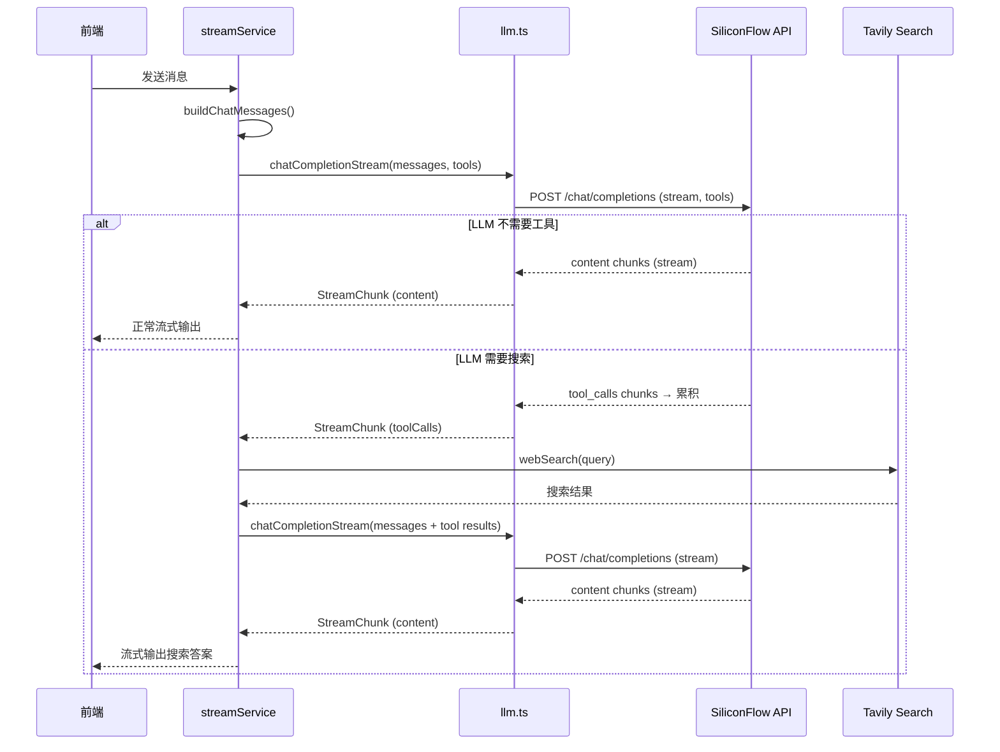

# LLM Chat 集成 Web Search 能力：从原理到实现

## 目录

1. [问题背景](#1-问题背景)
2. [Function Calling 协议详解](#2-function-calling-协议详解)
3. [工具调用循环（Tool Calling Loop）](#3-工具调用循环tool-calling-loop)
4. [Tavily Search API 接入](#4-tavily-search-api-接入)
5. [SSE 流中 tool_calls 的解析技巧](#5-sse-流中-tool_calls-的解析技巧)
6. [项目分层架构决策](#6-项目分层架构决策)
7. [优雅降级与防护措施](#7-优雅降级与防护措施)
8. [可扩展性设计](#8-可扩展性设计)
9. [完整数据流](#9-完整数据流)

---

## 1. 问题背景

### 1.1 LLM 的局限性

大语言模型（LLM）的知识来源于训练数据，存在一个**知识截止日期（knowledge cutoff）**。训练完成后，模型对以下类型的问题无能为力：

- 实时信息：天气、股价、新闻
- 最新事件：近期发生的技术更新、政策变化
- 动态数据：航班状态、体育比分

当用户问"今天北京天气怎么样？"时，模型只能回答"我无法获取实时信息"。

### 1.2 解决思路

核心思想很简单：**让 LLM 能"使用工具"**。

但 LLM 本身只能生成文本，不能直接调用 API。解决方案是通过一个**协议**让 LLM 表达"我需要调用某个工具"的意图，由应用层（我们的服务器）去执行工具，再把结果喂回给 LLM。

这就是 **Function Calling**（也叫 Tool Use）。

---

## 2. Function Calling 协议详解

### 2.1 核心概念

Function Calling 是 OpenAI 在 2023 年 6 月引入的 Chat Completions API 扩展。其核心思想是在请求中告诉模型"你有哪些工具可以用"，模型在需要时会返回"我要调用这个工具，参数是这些"，而不是直接生成文本回答。

三个关键角色：

| 角色 | 说明 |
|------|------|
| **Tool Definition** | 开发者定义的工具描述（名称、功能、参数 schema），随请求发送给 LLM |
| **Tool Call** | LLM 返回的工具调用请求（工具名 + 参数），表示"我需要这个工具的结果" |
| **Tool Result** | 开发者执行工具后，将结果以 `role: "tool"` 消息回传给 LLM |

### 2.2 请求格式

在标准的 Chat Completions 请求基础上，新增 `tools` 字段：

```json
{
  "model": "Qwen/Qwen2.5-7B-Instruct",
  "messages": [
    { "role": "user", "content": "北京今天天气怎么样？" }
  ],
  "tools": [
    {
      "type": "function",
      "function": {
        "name": "web_search",
        "description": "Search the web for real-time information...",
        "parameters": {
          "type": "object",
          "properties": {
            "query": {
              "type": "string",
              "description": "The search query"
            }
          },
          "required": ["query"]
        }
      }
    }
  ],
  "stream": true
}
```

**`tools` 字段解析：**

- `type`: 目前只有 `"function"` 一种类型
- `function.name`: 工具名称，LLM 在调用时会引用这个名称
- `function.description`: 自然语言描述，**这是 LLM 判断何时使用工具的关键依据**。描述越清晰，LLM 的工具选择越准确
- `function.parameters`: JSON Schema 格式的参数描述，LLM 会据此生成结构化参数

### 2.3 响应格式

LLM 的响应有两种情况：

**情况 A：不需要工具**（`finish_reason: "stop"`）

```json
{
  "choices": [{
    "message": {
      "role": "assistant",
      "content": "1+1 等于 2。"
    },
    "finish_reason": "stop"
  }]
}
```

和普通对话完全一样，`content` 是文本回答。

**情况 B：需要调用工具**（`finish_reason: "tool_calls"`）

```json
{
  "choices": [{
    "message": {
      "role": "assistant",
      "content": null,
      "tool_calls": [
        {
          "id": "call_abc123",
          "type": "function",
          "function": {
            "name": "web_search",
            "arguments": "{\"query\": \"北京今天天气\"}"
          }
        }
      ]
    },
    "finish_reason": "tool_calls"
  }]
}
```

关键区别：

- `content` 为 `null`（没有文本回答）
- `finish_reason` 为 `"tool_calls"` 而不是 `"stop"`
- 多了 `tool_calls` 数组，每个元素包含：
  - `id`：唯一标识，后续回传结果时需要对应
  - `function.name`：要调用的工具名
  - `function.arguments`：JSON 字符串格式的参数

### 2.4 回传工具结果

拿到工具执行结果后，需要构建新的 messages 数组回传：

```json
{
  "messages": [
    { "role": "user", "content": "北京今天天气怎么样？" },
    {
      "role": "assistant",
      "content": null,
      "tool_calls": [
        {
          "id": "call_abc123",
          "type": "function",
          "function": {
            "name": "web_search",
            "arguments": "{\"query\": \"北京今天天气\"}"
          }
        }
      ]
    },
    {
      "role": "tool",
      "tool_call_id": "call_abc123",
      "content": "[1] 北京天气\n晴，气温 22°C，东北风3级\nSource: https://weather.com/..."
    }
  ],
  "tools": [...],
  "stream": true
}
```

注意 messages 中新增了两条：

1. `role: "assistant"` 带 `tool_calls` — 记录 LLM 之前的工具调用请求
2. `role: "tool"` 带 `tool_call_id` — 对应工具的执行结果

`tool_call_id` 必须与 `tool_calls[].id` 一一对应，否则 API 会报错。

LLM 收到工具结果后，会基于这些信息生成最终的文本回答。

### 2.5 关于 `finish_reason` 的语义

`finish_reason` 是 LLM 告诉你"我为什么停止生成"的信号：

| 值 | 含义 |
|----|------|
| `stop` | 正常完成，`content` 是最终回答 |
| `tool_calls` | 需要调用工具，`tool_calls` 有值 |
| `length` | 达到 token 上限被截断 |
| `content_filter` | 内容被安全过滤 |

在 Function Calling 场景中，我们主要关注 `stop` 和 `tool_calls` 的区分。

---

## 3. 工具调用循环（Tool Calling Loop）

### 3.1 为什么需要"循环"

一次对话中，LLM 可能需要**多次工具调用**。例如：

> 用户："对比北京和上海今天的天气"

LLM 可能返回两个 tool_calls（同时搜索北京天气和上海天气），也可能分两轮分别搜索。

更极端的情况：LLM 用第一次搜索的结果发现信息不足，再请求第二次搜索。

因此工具调用不是"一次性"的，而是一个**循环**：

```
请求 LLM（带 tools）
  ├→ 返回 content → 结束
  └→ 返回 tool_calls → 执行工具 → 带结果再请求 LLM
       ├→ 返回 content → 结束
       └→ 返回 tool_calls → 再次执行工具 → ...
```

### 3.2 循环次数限制

没有限制的循环是危险的。如果 LLM 反复请求工具调用（模型 bug 或 prompt 问题），会导致：

- 无限调用外部 API（费用失控）
- 用户等待时间无限增长
- 服务器资源耗尽

本项目设置 `MAX_TOOL_ROUNDS = 3`。超过限制后，做最后一次不带 `tools` 的请求，强制 LLM 基于已有信息生成回答。

### 3.3 本项目的实现策略

我们选择"**始终流式 + 流中检测 tool_calls**"的策略：

```
第 1 轮（流式，带 tools）
  ├→ 收到 content chunks → 直接透传给用户 → 正常流式体验
  └→ 收到 tool_calls（流中累积）→ 执行工具
       → 第 2 轮（流式，带工具结果）
          ├→ 收到 content chunks → 透传给用户
          └→ 收到 tool_calls → 继续循环（最多到第 3 轮）
```

**优势**：

- 当 LLM 不需要工具时，用户获得完整流式体验（逐字输出），与改造前完全一致
- 当 LLM 需要工具时，第一轮几乎不产生可见延迟（因为 tool_calls 很短），用户感知为"短暂思考后开始流式回答"

**替代方案对比**：

| 方案 | 优点 | 缺点 |
|------|------|------|
| 始终流式（本项目采用） | 无工具时保留完整流式体验 | 需要解析流式 tool_calls delta |
| 两阶段（先非流式探测） | 实现简单 | 无工具时丢失流式体验 |
| 始终非流式 | 最简单 | 完全无流式体验 |

---

## 4. Tavily Search API 接入

### 4.1 为什么选择 Tavily

| 搜索 API | 免费额度 | 特点 |
|----------|---------|------|
| **Tavily** | 1000 次/月 | 专为 AI 设计，返回结构化摘要，无需额外清洗 |
| Serper | 2500 次 | 基于 Google，需自行处理 HTML 片段 |
| SerpAPI | 100 次/月 | 最稳定但免费额度少 |

Tavily 的核心优势是**返回的结果已经是 AI 友好的文本摘要**，而不是 HTML 片段或原始网页内容。这意味着搜索结果可以直接作为 LLM 的上下文，无需额外的文本清洗和提取。

### 4.2 API 调用

```
POST https://api.tavily.com/search
Content-Type: application/json

{
  "api_key": "tvly-xxx",
  "query": "北京今天天气",
  "search_depth": "basic",
  "max_results": 5
}
```

响应：

```json
{
  "results": [
    {
      "title": "北京天气预报",
      "url": "https://weather.com/...",
      "content": "北京今日天气：晴，最高气温 22°C..."
    }
  ]
}
```

### 4.3 结果格式化

搜索结果需要格式化为 LLM 能理解的文本。我们采用编号列表格式：

```
[1] 北京天气预报
北京今日天气：晴，最高气温 22°C...
Source: https://weather.com/...

[2] 中国天气网
...
```

这种格式让 LLM 能够：

- 理解每条结果的来源
- 综合多条结果生成回答
- 在回答中引用来源（如果需要）

---

## 5. SSE 流中 tool_calls 的解析技巧

### 5.1 流式 tool_calls 的挑战

在非流式模式中，`tool_calls` 作为完整的 JSON 对象一次性返回，解析简单。但在流式（SSE）模式中，`tool_calls` 以 **delta 片段**的形式分多个 chunk 返回，需要累积拼装。

### 5.2 Delta 格式示例

一个 `web_search` 工具调用的流式传输过程：

```
// Chunk 1: 工具调用结构初始化
data: {"choices":[{"delta":{"tool_calls":[{"index":0,"id":"call_abc123","type":"function","function":{"name":"web_search","arguments":""}}]},"finish_reason":null}]}

// Chunk 2-N: arguments 分片
data: {"choices":[{"delta":{"tool_calls":[{"index":0,"function":{"arguments":"{\"qu"}}]},"finish_reason":null}]}
data: {"choices":[{"delta":{"tool_calls":[{"index":0,"function":{"arguments":"ery\":"}}]},"finish_reason":null}]}
data: {"choices":[{"delta":{"tool_calls":[{"index":0,"function":{"arguments":" \"北京天气\"}"}}]},"finish_reason":null}]}

// 最终 Chunk: finish_reason 标记完成
data: {"choices":[{"delta":{},"finish_reason":"tool_calls"}]}
data: [DONE]
```

关键观察：

- **`index` 字段**：标识这是第几个工具调用（从 0 开始），用于区分多个并发工具调用
- **`id` 只在首个 chunk 出现**：后续 chunk 只通过 `index` 关联
- **`function.name` 只在首个 chunk 出现**
- **`function.arguments` 是 JSON 字符串的分片**：需要逐片拼接

### 5.3 累积算法

```typescript
// 用 Map<index, accumulated> 存储累积状态
const accumulator = new Map<number, { id: string; name: string; arguments: string }>();

function mergeToolCallDelta(deltas: ToolCallDelta[]) {
  for (const d of deltas) {
    const existing = accumulator.get(d.index);
    if (existing) {
      // 后续 chunk：只追加 arguments
      if (d.function?.arguments) {
        existing.arguments += d.function.arguments;
      }
    } else {
      // 首个 chunk：初始化 id、name、arguments
      accumulator.set(d.index, {
        id: d.id ?? '',
        name: d.function?.name ?? '',
        arguments: d.function?.arguments ?? '',
      });
    }
  }
}
```

当 `finish_reason === "tool_calls"` 时，从 accumulator 中提取完整的 `ToolCall[]`，此时 `arguments` 已经是完整的 JSON 字符串，可以安全 `JSON.parse()`。

### 5.4 多工具调用

当 LLM 同时请求多个工具（比如同时搜索北京和上海的天气），delta 会交错出现：

```
// 工具 0 的初始化
{"delta":{"tool_calls":[{"index":0,"id":"call_1","function":{"name":"web_search","arguments":""}}]}}
// 工具 1 的初始化
{"delta":{"tool_calls":[{"index":1,"id":"call_2","function":{"name":"web_search","arguments":""}}]}}
// 工具 0 的 arguments
{"delta":{"tool_calls":[{"index":0,"function":{"arguments":"{\"query\":\"北京天气\"}"}}]}}
// 工具 1 的 arguments
{"delta":{"tool_calls":[{"index":1,"function":{"arguments":"{\"query\":\"上海天气\"}"}}]}}
```

`index` 字段确保了即使 delta 交错，也能正确累积到对应的工具调用。

### 5.5 文本格式 tool_calls 的兼容处理

并非所有模型/提供商都严格遵循 OpenAI 的 `tool_calls` 结构化字段。部分模型（如 Qwen 系列通过某些 OpenAI-compatible API 提供商调用时）会将工具调用以**文本标签**的形式输出在 `delta.content` 中，而非 `delta.tool_calls`：

```
<tool_call>
{"name": "web_search", "arguments": {"query": "北京天气"}}
</tool_call>
```

这会导致两个问题：

1. 编排层检测不到 `toolCalls`，搜索不会被执行
2. `<tool_call>` 标签文本作为普通 content 被流式输出给用户，出现 `}</tool_call>` 等垃圾字符

**解决方案：首轮缓冲 + 文本解析回退**

```
第 1 轮（当 tools 已配置时）：
  ├→ 缓冲所有 content（不立即 yield 给用户）
  ├→ 流结束后检查：
  │   ├→ 有结构化 tool_calls → 标准处理（执行工具，进入第 2 轮）
  │   ├→ content 匹配 <tool_call> 标签 → 解析 JSON，构造 ToolCall 对象，执行工具
  │   └→ 都没有 → flush 缓冲内容给用户（非流式但完整）
  └→ 第 2 轮及之后：正常流式输出
```

**解析算法**：

```typescript
const TOOL_CALL_TAG_RE = /<tool_call>\s*([\s\S]*?)\s*<\/tool_call>/g;

function parseToolCallsFromContent(content: string): ToolCall[] | undefined {
  const matches = [...content.matchAll(TOOL_CALL_TAG_RE)];
  if (matches.length === 0) return undefined;

  return matches.map((match, i) => {
    const parsed = JSON.parse(match[1].trim());
    return {
      id: `text_call_${i}`,           // 生成占位 ID
      type: 'function',
      function: {
        name: parsed.name,
        arguments: typeof parsed.arguments === 'string'
          ? parsed.arguments
          : JSON.stringify(parsed.arguments),
      },
    };
  });
}
```

**UX 影响**：

| 场景 | 有 tools 配置 | 无 tools 配置 |
|------|-------------|--------------|
| 不需要搜索 | 首轮内容整体返回（非逐字流式），后续轮次正常流式 | 完全流式（不变） |
| 需要搜索 | 首轮缓冲检测工具调用，第 2 轮流式输出搜索结果 | N/A |

首轮非流式是为了确保 `<tool_call>` 文本不会泄漏到用户界面。对于 7B 模型，首轮生成通常在 2-5 秒内完成，影响可接受。

---

## 6. 项目分层架构决策

方案概览：



### 6.1 职责分层

```
apps/server/src/
├── lib/
│   ├── openaiCompatible.ts   ← HTTP 通信层：SSE 解析、tool_calls 累积
│   ├── llm.ts                ← Provider 抽象层：路由到正确的 LLM 后端
│   └── searchProvider.ts     ← 搜索适配器层：Tavily API 封装 + 工具定义
│
└── service/chat/
    └── streamService.ts      ← 业务编排层：工具调用循环、会话管理
```

### 6.2 每一层的边界

**`openaiCompatible.ts`（HTTP 通信层）**

只关心一件事：如何与 OpenAI 兼容 API 正确通信。

- 构建 HTTP 请求（headers、body、超时控制）
- 解析 SSE 流
- 累积 tool_calls delta
- **不知道** 有哪些工具、也不执行工具

为什么 tool_calls 累积在这一层？因为 delta 拼装是 SSE 协议层面的事，与具体工具无关。这类似于 HTTP 客户端负责处理 chunked transfer encoding，而不是让业务层处理。

**`llm.ts`（Provider 抽象层）**

做 provider 路由：根据 `LLM_PROVIDER` 环境变量将请求路由到 `ollama.ts` 或 `openaiCompatible.ts`。

- 目前 Function Calling 仅 OpenAI-compatible 支持
- 如果未来 Ollama 也支持 tools，只需在这里扩展路由
- **不知道** 具体工具，也不做编排

**`searchProvider.ts`（搜索适配器层）**

Tavily API 的基础设施适配器，放在 `lib/` 目录。

关键设计决策：**工具定义常量 `WEB_SEARCH_TOOL` 与实现 `webSearch()` 同文件共置**。

原因：工具定义中的 `description` 和 `parameters` 必须与实际实现保持一致。如果分散在不同文件中，修改一方容易忘记同步另一方。

**`streamService.ts`（业务编排层）**

工具调用循环的编排者，位于 `service/chat/`。

为什么不在 `lib/llm.ts` 中编排？

- 编排需要知道"有哪些工具"→ 依赖 `searchProvider`
- `lib/` 层不应该依赖其他 `lib/` 模块的业务含义
- `service/` 是业务逻辑的正确位置

### 6.3 类型定义的位置

`ToolCall`、`ChatMessage`、`ToolDefinition` 等类型定义在 `openaiCompatible.ts` 中，通过 `llm.ts` 重新导出。

原因：

- 这些类型本质上是 OpenAI Chat Completions 协议的一部分
- 它们在 `openaiCompatible.ts` 中首先被使用（构建请求、解析响应）
- 通过 `llm.ts` 重新导出，`streamService.ts` 可以从统一入口 `@/lib/llm` 导入
- 不放在 `types/` 目录，因为它们不是跨领域的共享契约，而是 LLM 模块内部的协议类型

---

## 7. 优雅降级与防护措施

### 7.1 API Key 未配置时的降级

```typescript
// searchProvider.ts
export const WEB_SEARCH_TOOL: ToolDefinition | null = process.env.TAVILY_API_KEY?.trim()
  ? { /* 工具定义 */ }
  : null;
```

```typescript
// streamService.ts
function getActiveTools(): ToolDefinition[] | undefined {
  const tools: ToolDefinition[] = [];
  if (WEB_SEARCH_TOOL) tools.push(WEB_SEARCH_TOOL);
  return tools.length > 0 ? tools : undefined;
}
```

当 `TAVILY_API_KEY` 未配置时：

- `WEB_SEARCH_TOOL` 为 `null`
- `getActiveTools()` 返回 `undefined`
- `chatCompletionStream` 不带 `tools` 参数
- LLM 行为与改造前完全一致

### 7.2 工具执行错误处理

```typescript
// searchProvider.ts
export async function executeToolCall(name: string, args: Record<string, unknown>): Promise<string> {
  const handler = TOOL_REGISTRY[name];
  if (!handler) return `Unknown tool: ${name}`;
  try {
    return await handler(args);
  } catch (error) {
    return `Tool error: ${error.message}`;
  }
}
```

工具执行失败时不抛出异常，而是返回错误信息字符串。LLM 会看到这个错误信息，并以适当方式告知用户（例如"搜索暂时不可用，我只能基于已有知识回答"）。

### 7.3 搜索超时

Tavily 调用设置了 15 秒超时（`AbortController`），防止网络问题导致用户长时间等待。

### 7.4 循环次数限制

`MAX_TOOL_ROUNDS = 3`，超过后做最后一次无 tools 的请求，强制生成回答。

---

## 8. 可扩展性设计

### 8.1 添加新工具

只需在 `searchProvider.ts`（或拆分为独立的 `toolRegistry.ts`）中注册：

```typescript
// 1. 实现工具函数
async function calculateExpression(expr: string): Promise<string> { /* ... */ }

// 2. 定义工具描述
const CALCULATOR_TOOL: ToolDefinition = {
  type: 'function',
  function: {
    name: 'calculate',
    description: 'Evaluate a mathematical expression',
    parameters: { /* ... */ },
  },
};

// 3. 注册到路由表
const TOOL_REGISTRY = {
  web_search: (args) => webSearch(String(args.query)),
  calculate: (args) => calculateExpression(String(args.expression)),
};
```

`streamService.ts` 中的编排逻辑不需要修改——它通过 `getActiveTools()` 自动获取所有已注册工具，通过 `executeToolCall()` 自动路由到对应处理函数。

### 8.2 未来演进方向

- **工具结果缓存**：相同的搜索查询在短时间内不重复调用 Tavily
- **并发工具调用**：当 LLM 返回多个 tool_calls 时，并发执行而非串行
- **Ollama 支持**：Ollama 也支持 Function Calling（通过 `/api/chat` 端点），可在 `llm.ts` 中扩展路由
- **前端工具状态展示**：在聊天 UI 中显示"正在搜索..."状态，提升用户感知

---

## 9. 完整数据流

### 9.1 不需要搜索的场景

```
用户输入 "什么是 TypeScript？"
  → ChatComposer.onSend → useChatSessionController.send()
  → sendChatMessage mutation（创建 user + assistant 消息）
  → subscribe chatSessionStream(sessionId, messageId)
  → chatResolver → streamSessionAssistantReply()
  → buildChatMessages() → [{ role: "user", content: "什么是TypeScript？" }]
  → getActiveTools() → [web_search_tool]（或 undefined）
  → streamWithToolSupport(messages, tools)
    → chatCompletionStream({ messages, tools })
      → POST /chat/completions (stream: true, tools)
      → LLM 判断不需要搜索
      → SSE 返回 content chunks (finish_reason: "stop")
    → 逐个 yield content chunks
  → ChatThread 逐字渲染
```

### 9.2 需要搜索的场景

```
用户输入 "今天北京天气怎么样？"
  → （前半段同上）
  → streamWithToolSupport(messages, tools)
    → 第 1 轮：chatCompletionStream({ messages, tools })
      → POST /chat/completions (stream: true, tools)
      → LLM 决定搜索
      → SSE 返回 tool_calls delta → 累积拼装
      → 最终 chunk: { toolCalls: [{ name: "web_search", args: { query: "北京天气" } }] }
    → executeToolCall("web_search", { query: "北京天气" })
      → Tavily API → 返回搜索结果文本
    → 构建新 messages（原始 + assistant tool_calls + tool result）
    → 第 2 轮：chatCompletionStream({ messages: extended })
      → POST /chat/completions (stream: true)
      → LLM 基于搜索结果生成回答
      → SSE 返回 content chunks (finish_reason: "stop")
    → 逐个 yield content chunks
  → ChatThread 逐字渲染（用户看到基于实时搜索的回答）
```

### 9.3 用户感知

| 场景 | 用户体验 |
|------|---------|
| 不需要搜索 | 与改造前完全一致：立即开始逐字流式输出 |
| 需要搜索 | 短暂等待（~2-3 秒，含 LLM 决策 + Tavily 搜索），然后开始逐字流式输出 |
| Tavily 未配置 | 与改造前完全一致：LLM 正常回答但无法获取实时信息 |
| Tavily 调用失败 | LLM 收到错误信息，会告知用户搜索暂不可用并尝试基于已有知识回答 |
